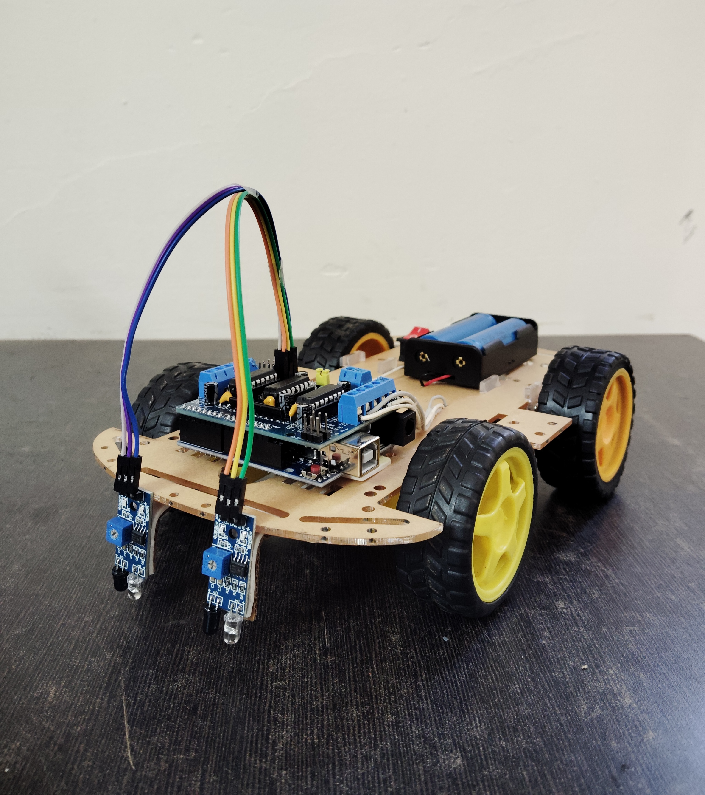

# Line Following Robot with Obstacle Avoidance

A C-based autonomous robot that follows lines and avoids obstacles using IR sensors and ultrasonic detection.

## Demo Video

## Gallery

  
  

## Features

- **Line Following**: Dual IR sensor system for accurate line tracking
- **Obstacle Avoidance**: Ultrasonic sensor with automatic bypass maneuvers
- **Motor Control**: Precise movement control for smooth navigation

## Hardware Requirements

- Arduino/Microcontroller
- 2x DC Motors with H-Bridge Driver
- 2x IR Sensors
- 1x Ultrasonic Sensor (HC-SR04)
- Chassis and wheels

## Pin Configuration

| Component | Pin |
|-----------|-----|
| Left Motor | 2, 3 |
| Right Motor | 4, 5 |
| IR Sensors | 6, 7 |
| Ultrasonic | 8, 9 |

## Circuit Diagram

## Quick Start

1. Upload `line_following_robot.c` to your microcontroller
2. Connect hardware according to pin configuration
3. Place robot on a black line track
4. Power on and watch it navigate

## How It Works

## License

MIT License